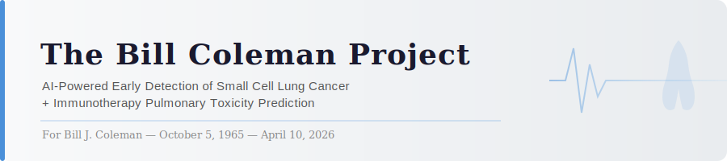
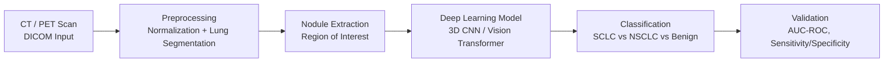
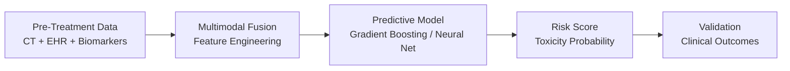

<p align="center">
  
</p>

<p align="center">
  
  
  
  
  
</p>

---

<p align="center">
  <em>"This is not an abstract research interest. This is a wound that became a question."</em>
</p>

---

## Dedication

<table>
<tr>
<td width="180px">

<!-- Replace the line below with:  once you add his photo to assets/ -->


</td>
<td>

**Bill J. Coleman**
<br/>October 5, 1965 — April 10, 2026
<br/>Minnesota

<br/>He came into my life when I was 8 years old and stayed for 26 years.
<br/>Star Wars fan. Bird watcher. Lover of dogs. Strong heart until the very end.

<br/><br/>Bill was diagnosed with small cell lung cancer in 2025. He was told there was not much time. Seeking hope, he pursued immunotherapy treatment at City of Hope. The treatment damaged his lungs. He passed away on April 10, 2026. He was 60 years old.

<br/><br/><em>This project is for him, and for everyone who sat in a waiting room and heard there wasn't much time.</em>

</td>
</tr>
</table>

---

## Why This Exists

Small cell lung cancer (SCLC) is one of the most aggressive and deadliest cancers known to medicine. The five-year survival rate is approximately **7%**. Most patients are diagnosed at extensive stage, meaning the cancer has already spread because early detection is genuinely hard. The signals are subtle. The window is narrow. And by the time a patient walks into a clinic with symptoms, time is already short.

The Bill Coleman Project is a research initiative at the intersection of **machine learning and clinical oncology**. It has two goals:

- 🔬 **Early Detection**: Improve AI-driven detection of SCLC from medical imaging before it reaches extensive stage
- 💊 **Toxicity Prediction**: Predict immunotherapy-induced pulmonary toxicity before treatment begins to prevent the lung damage that compounds an already devastating diagnosis

---

## The Problem

### Early Detection

SCLC is fast-moving. Between 60–70% of patients are diagnosed at extensive stage. At limited stage, 5-year survival climbs to **15–30%**. The difference between those two numbers is the difference between time and no time.

Current detection relies on low-dose CT screening, but SCLC's rapid doubling time and subtle early imaging features make it easy to miss. AI models trained on large clinical imaging datasets have the potential to identify patterns that radiologists cannot consistently detect, catching the disease at a stage where intervention still meaningfully changes outcomes.

<p align="center">
  
  <br/>
  <sub><em>Small cell lung carcinoma — public domain, Wikimedia Commons</em></sub>
</p>

### Immunotherapy-Induced Pulmonary Toxicity

Checkpoint inhibitor immunotherapy has become a standard treatment for SCLC. But immune-related adverse events, particularly **pneumonitis** (inflammation of lung tissue) are a serious and sometimes fatal complication.

Predicting which patients will develop severe pulmonary toxicity before treatment starts is an **open clinical problem**. A model that identifies high-risk patients could:
- Inform treatment decisions before they are made
- Change dosing protocols for at-risk individuals
- Prevent the treatment-induced deterioration that compounds an already devastating diagnosis

---

## Research Questions

1. Can a deep learning model trained on CT imaging data detect SCLC at **earlier stages** than current clinical workflows?
2. What imaging and clinical features are most predictive of SCLC versus non-small cell lung cancer (NSCLC) at first presentation?
3. Can a multimodal model combining imaging, EHR data, and biomarkers — **predict severe immunotherapy-induced pulmonary toxicity** before treatment begins?
4. What does the longitudinal imaging trajectory of SCLC look like computationally, and can **progression rate** be predicted from early scans?

---

## Pipeline Architecture

### Thread 1 — Early Detection



### Thread 2 — Toxicity Prediction



---

## Technical Approach

### Thread 1 — Detection

| Stage | Method |
|---|---|
| **Data** | Low-dose CT scans, PET imaging (Mayo Clinic / public datasets) |
| **Preprocessing** | DICOM normalization, lung segmentation, nodule extraction |
| **Modeling** | 3D CNN, Vision Transformer (ViT), ensemble approaches |
| **Validation** | AUC-ROC, sensitivity/specificity at clinical thresholds |
| **Comparison** | Benchmark against radiologist performance and existing CAD tools |

### Thread 2 — Immunotherapy Toxicity Prediction

| Stage | Method |
|---|---|
| **Data** | EHR data, pre-treatment CT, biomarkers, treatment records |
| **Preprocessing** | Multimodal fusion, missing data handling, feature engineering |
| **Modeling** | Gradient boosting, multimodal neural networks, survival models |
| **Outcome** | Binary toxicity classification + severity grading |
| **Validation** | Prospective validation against clinical outcomes |

---

## Datasets

| Dataset | Description |
|---|---|
| **LIDC-IDRI** | Lung Image Database Consortium — 1,018 CT scans with radiologist annotations |
| **NLST** | National Lung Screening Trial — low-dose CT screening data |
| **TCIA** | The Cancer Imaging Archive — multiple lung cancer collections |
| **PhysioNet** | Supplementary clinical and physiological data |

> Clinical data access through Mayo Clinic institutional partnership *(future phase)*

---

## Project Status

| Component | Status |
|---|---|
| Literature review | 🔄 In progress |
| Dataset acquisition | 🔄 In progress |
| Preprocessing pipeline | 📋 Planned |
| Baseline detection model | 📋 Planned |
| Toxicity prediction model | 📋 Planned |
| Validation & benchmarking | 📋 Planned |

---

## Connection to Broader Research

The Bill Coleman Project exists alongside a parallel research thread:

**[cortex-unsupervised](https://github.com/ssommera/cortex-unsupervised)** — an unsupervised EEG neural state discovery pipeline exploring the computational dynamics of consciousness and neural state boundaries.

Together, these projects represent two sides of the same research question:

> *What happens to a person on the way out and could we have done more on the way in?*

---

## Installation

```bash
git clone https://github.com/ssommera/Bill_Coleman_Project.git
cd Bill_Coleman_Project
pip install -r requirements.txt
```

---

## License

MIT License. All public datasets used in accordance with their respective terms of use.

*This project is independent research and is not affiliated with any university or institution.*

---

<p align="center">
  <em>For Bill J. Coleman — October 5, 1965 — April 10, 2026</em><br/>
  <em>Step-dad, Star Wars fan, bird watcher, lover of dogs.</em><br/><br/>
  <strong>May the force be with you, Bill</strong>
</p